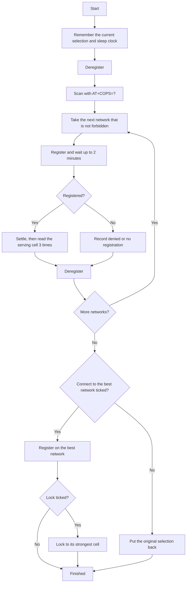

# Network Survey (Smart Scan)

The Network Survey card finds every network the module can see, measures the signal on each one, ranks them, and can connect to the best one. This page explains what it does, in what order, and how to read the result. The AT commands involved are listed in the [command reference](command-reference.md).

> **Note:** the Network Survey is not the same as the Scan button. The Scan button only lists networks (`AT+COPS=?`). The survey scans, then joins each network in turn and measures it.

## What you get

For each network that is not forbidden:

- Whether the module could register on it: registered, denied, or no registration within 2 minutes.
- RSRP, RSRQ and SINR, each averaged over three readings.
- Every cell seen on that network, listed under it: the serving cell, then the neighbour cells the module reports, strongest first. Each shows PCI, EARFCN, RSRP and RSRQ, and the strongest cell is marked.
- How long the network took to register.

The best network is ranked by RSRP, then SINR, then RSRQ (higher is better). Denied and silent networks are listed but never ranked.

The survey measures where the module is. To compare places, run it in each place and compare the tables.

## How it runs

1. The survey notes your current selection (`AT+COPS?`) and sleep-clock setting, and turns the sleep clock off so the module stays awake.
1. It deregisters and scans. The scan takes about 5 minutes on a BC660K-GL. If the module gives no answer, the survey stops with an error and restores your selection.
1. For each network it registers, waits for the module to attach (polling every 3 seconds, up to 2 minutes), waits a few seconds to settle, reads the serving cell three times, records the averages and every cell, then deregisters.
1. At the end it either joins the best network, or puts back your original selection.
1. Whatever happens, including an error or pressing Stop, the original selection and sleep clock are restored unless the best network was joined.

Expect 10 to 20 minutes with no data connection. Stop takes effect after the network being tried, not during the scan.

## Options

| Option | Default | Effect |
| --- | --- | --- |
| Connect to the best network when done | On | Joins the best network at the end. Off puts your original selection back. |
| Lock to its strongest cell | Off | After joining the best network, locks the module to that network's strongest cell. Needs the first option. |

### Locking to the strongest cell

Without the lock, the module chooses its own cell on the network. With it:

1. The survey reads the current lock (`AT+QLOCKF?`) so it can be put back.
1. It switches the radio off (`AT+CFUN=0`), sends `AT+QLOCKF=1,<EARFCN>,<PCI>`, and switches the radio on (`AT+CFUN=1`). The manual only allows the lock with the radio off.
1. It registers on the best network again.
1. If the module cannot attach, the previous lock is put back (or the lock is removed if there was none) and it registers again. If that also fails, your original selection comes back.

A few things to know:

- The lock is saved by the module and survives reboots. The status line shows "Locked to EARFCN x, PCI y" when one is active.
- To remove it later, send `AT+CFUN=0`, `AT+QLOCKF=0`, `AT+CFUN=1` from the AT console.
- An existing lock limits what a survey can see, so remove it before surveying.
- The strongest cell is the strongest measured while on that network. A neighbour cell can be stronger than the serving cell. If the module will not attach to it, the fallback above applies.
- If the module does not answer `AT+QLOCKF?`, the survey leaves it unlocked and says so in the log.

> **Warning:** locking to a cell that later goes away can leave the module unable to register. Remove the lock if the signal disappears.

## Limits

- Written against the scan and registration behaviour seen on a BC660K-GL. A full survey, and the cell lock, have not yet been run on hardware.
- Only one survey, scan or registration change can run at a time. Starting another gives HTTP 409.
- Networks your SIM is not allowed on show as denied.

## Related

- Code: `survey.py` (the procedure) and `serial_manager.py` (`start_network_survey`).
- Tests: `tests/test_survey.py`, using a fake module.
- HTTP: `POST /api/survey` and `POST /api/survey/stop`.
